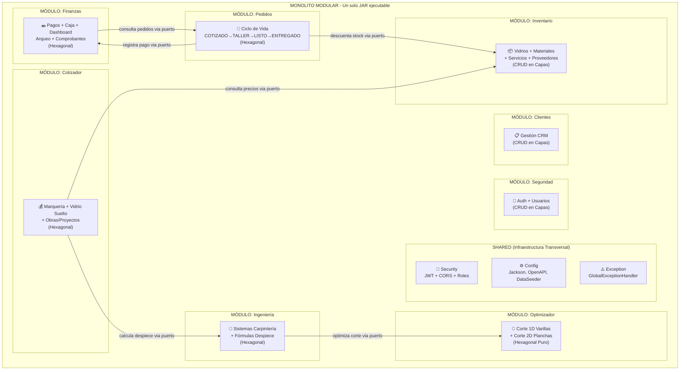
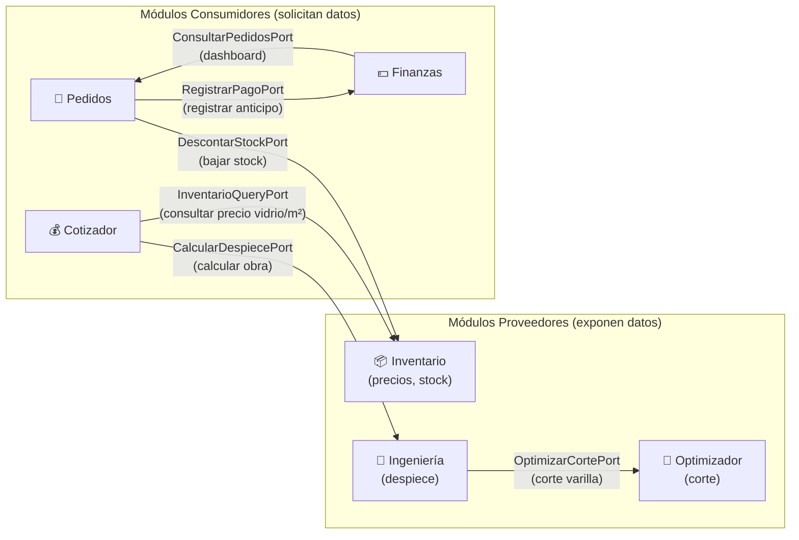
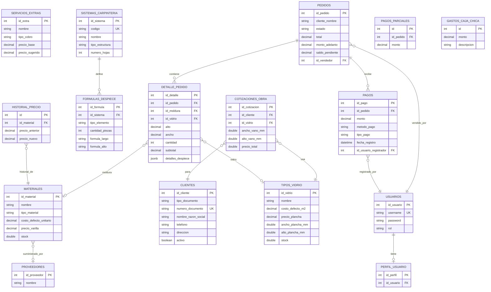

# 🏗️ Bosquejo Arquitectónico: Monolito Modular con Arquitectura Hexagonal
## Sistema de Gestión Integral para Vidriería y Marquería

> **Proyecto de Tesis** — Refactorización de un sistema monolítico tradicional a un **Monolito Modular con principios de Arquitectura Hexagonal (Puertos y Adaptadores)**.

---

## 1. Situación Actual (AS-IS)

### 1.1 Estructura actual del Backend (Spring Boot 3)

El proyecto actual sigue una **arquitectura monolítica en capas horizontales** clásica, donde los archivos se agrupan por función técnica:

```
backend-vidrieria/src/main/java/com/vidrieria/backend_vidrieria/
├── BackendVidrieriaApplication.java
├── config/          ← SecurityConfig, JacksonConfig, OpenApiConfig, DataSeeder
├── security/        ← JwtAuthenticationFilter, JwtService, UserDetailsServiceImpl
├── controller/      ← 16 controladores REST (todos mezclados en una sola carpeta)
├── service/         ← 18 servicios (desde CRUDs simples hasta algoritmos de 60KB)
├── repository/      ← 15 repositorios JPA (todos juntos)
├── entity/          ← 21 entidades JPA (todas juntas, sin agrupación por dominio)
├── dto/             ← 50 DTOs (request/response mezclados de todos los procesos)
└── exception/       ← GlobalExceptionHandler
```

### 1.2 Estructura actual del Frontend (React + Vite)

```
frontend-vidrieria/src/
├── api/             ← axiosClient.js (interceptores JWT)
├── assets/          ← Recursos estáticos
├── context/         ← PedidoContext.jsx (estado global de carrito)
├── layouts/         ← AdminLayout.jsx (sidebar + navegación)
├── services/        ← 5 archivos de capa de servicios (API layer)
├── utils/           ← Utilidades
└── pages/           ← Páginas JSX monolíticas (algunas de 50-95 KB)
    ├── components/  ← Componentes visuales compartidos (DiagramaSVG)
    ├── cotizador/components/    ← Componentes extraídos del cotizador
    └── inventario/components/   ← Componentes extraídos del inventario
```

### 1.3 Problemas identificados

| # | Problema | Evidencia en el Proyecto |
|---|----------|--------------------------|
| 1 | **Acoplamiento alto entre dominios** | `PedidoService.java` (685 líneas) importa directamente repositorios de Material, Vidrio, Pago y Usuario. Un cambio en inventario puede romper pedidos. |
| 2 | **Servicios "monstruo"** | `OptimizadorVidrioService.java` tiene **1,356 líneas** (60 KB) mezclando algoritmo Simulated Annealing, DTOs internos y lógica de presentación. |
| 3 | **Sin límites entre dominios (Bounded Contexts)** | Las 21 entidades están en una sola carpeta `entity/`, sin distinguir si pertenecen a inventario, ventas, finanzas o ingeniería. |
| 4 | **Lógica de negocio atada al framework** | Los cálculos matemáticos de despiece usan directamente Spring Expression Language (SpEL) y anotaciones `@Transactional`, haciendo imposible probar la lógica pura sin levantar el contexto Spring. |
| 5 | **50 DTOs sin agrupación** | DTOs de cotización, optimización, pedidos y dashboard viven todos en el mismo paquete `dto/`. |

---

## 2. Arquitectura Propuesta (TO-BE)

### 2.1 Nombre del Patrón

> **Monolito Modular con Arquitectura Hexagonal (Puertos y Adaptadores)**
> *(Modular Monolith + Hexagonal Architecture / Ports & Adapters)*

### 2.2 Principios rectores

1. **Un solo desplegable** — Sigue siendo un único `jar` ejecutable de Spring Boot (no microservicios).
2. **Separación vertical por dominio** — El código se agrupa por proceso de negocio, no por capa técnica.
3. **El dominio es el rey** — La lógica de negocio vive en clases Java puras, sin dependencias de Spring ni JPA.
4. **Inversión de dependencias** — Las capas externas (REST, Base de Datos) dependen del dominio, nunca al revés.
5. **Comunicación entre módulos por contratos** — Los módulos se comunican a través de interfaces públicas (puertos), no accediendo directamente a tablas de otros módulos.
6. **Pragmatismo** — Solo los módulos con lógica compleja usan hexagonal puro; los CRUDs simples mantienen capas tradicionales simplificadas.

### 2.3 Diagrama de Alto Nivel



---

## 3. Estructura de Paquetes Propuesta (Backend)

### 3.1 Vista general de paquetes

```
backend-vidrieria/src/main/java/com/vidrieria/backend_vidrieria/
│
├── BackendVidrieriaApplication.java
│
├── shared/                                    # ══ INFRAESTRUCTURA TRANSVERSAL ══
│   ├── config/
│   │   ├── SecurityConfig.java
│   │   ├── JacksonConfig.java
│   │   ├── OpenApiConfig.java
│   │   ├── DataSeeder.java
│   │   └── StringToCategoriaMaterialConverter.java
│   ├── security/
│   │   ├── JwtAuthenticationFilter.java
│   │   ├── JwtService.java
│   │   └── UserDetailsServiceImpl.java
│   └── exception/
│       └── GlobalExceptionHandler.java
│
│
├── modules/                                   # ══ MÓDULOS DE NEGOCIO ══
│
│   ├── seguridad/                             # ── Módulo 1: Seguridad y Usuarios ──
│   │   ├── controller/
│   │   │   ├── AuthController.java
│   │   │   └── UsuarioController.java
│   │   ├── service/
│   │   │   └── UsuarioService.java
│   │   ├── repository/
│   │   │   ├── UsuarioRepository.java
│   │   │   └── PerfilUsuarioRepository.java
│   │   ├── entity/
│   │   │   ├── Usuario.java
│   │   │   └── PerfilUsuario.java
│   │   └── dto/
│   │       ├── LoginRequestDTO.java
│   │       ├── LoginResponseDTO.java
│   │       └── PerfilUsuarioResponseDTO.java
│   │
│   │
│   ├── clientes/                              # ── Módulo 2: Gestión de Clientes ──
│   │   ├── controller/
│   │   │   └── ClienteController.java
│   │   ├── service/
│   │   │   └── ClienteService.java
│   │   ├── repository/
│   │   │   └── ClienteRepository.java
│   │   ├── entity/
│   │   │   └── Cliente.java
│   │   └── dto/
│   │       ├── ClienteRequestDTO.java
│   │       └── ClienteResponseDTO.java
│   │
│   │
│   ├── inventario/                            # ── Módulo 3: Inventario y Catálogos ──
│   │   ├── controller/
│   │   │   ├── TipoVidrioController.java
│   │   │   ├── MaterialController.java
│   │   │   ├── ServicioExtraController.java
│   │   │   └── ProveedorController.java
│   │   ├── service/
│   │   │   ├── TipoVidrioService.java
│   │   │   ├── MaterialService.java
│   │   │   ├── ServicioExtraService.java
│   │   │   └── ProveedorService.java
│   │   ├── repository/
│   │   │   ├── TipoVidrioRepository.java
│   │   │   ├── MaterialRepository.java
│   │   │   ├── ServicioExtraRepository.java
│   │   │   ├── ProveedorRepository.java
│   │   │   └── HistorialPrecioProveedorRepository.java
│   │   ├── entity/
│   │   │   ├── TipoVidrio.java
│   │   │   ├── Material.java
│   │   │   ├── CategoriaMaterial.java
│   │   │   ├── CategoriaMaterialConverter.java
│   │   │   ├── ServicioExtra.java
│   │   │   ├── TipoCobro.java
│   │   │   ├── TipoCobroConverter.java
│   │   │   ├── Proveedor.java
│   │   │   └── HistorialPrecioProveedor.java
│   │   ├── dto/
│   │   │   ├── TipoVidrioRequestDTO.java
│   │   │   ├── TipoVidrioResponseDTO.java
│   │   │   ├── MaterialRequestDTO.java
│   │   │   ├── MaterialResponseDTO.java
│   │   │   ├── ServicioExtraRequestDTO.java
│   │   │   └── ServicioExtraResponseDTO.java
│   │   └── port/                              # ☆ PUERTO PÚBLICO del módulo
│   │       └── InventarioQueryPort.java       #   Interface que otros módulos usan
│   │                                          #   para consultar precios y stock
│   │
│   │
│   ├── ingenieria/                            # ── Módulo 4: Ingeniería y Despiece ──
│   │   │                                      #    ★ HEXAGONAL: motor de fórmulas ★
│   │   ├── adapter/
│   │   │   ├── in/
│   │   │   │   ├── FormulaDespieceController.java      # Adaptador REST entrada
│   │   │   │   ├── SistemaCarpinteriaController.java
│   │   │   │   └── DespieceController.java
│   │   │   └── out/
│   │   │       └── DespieceJpaAdapter.java              # Adaptador JPA salida
│   │   ├── domain/
│   │   │   ├── model/
│   │   │   │   ├── SistemaCarpinteria.java              # Entidad de dominio
│   │   │   │   ├── FormulaDespiece.java
│   │   │   │   └── TipoEstructura.java
│   │   │   └── service/
│   │   │       ├── MotorDespieceService.java            # Motor SpEL (Java puro)
│   │   │       └── DespieceObraService.java             # Orquestador de cálculo
│   │   ├── port/
│   │   │   ├── in/
│   │   │   │   ├── CalcularDespieceUseCase.java         # Puerto de entrada
│   │   │   │   └── GestionSistemasCarpinteriaUseCase.java
│   │   │   └── out/
│   │   │       ├── SistemaRepository.java               # Puerto de salida (interface)
│   │   │       ├── FormulaRepository.java
│   │   │       └── ObtenerMaterialesPort.java           # Consulta al módulo inventario
│   │   └── dto/
│   │       ├── DespieceObraRequestDTO.java
│   │       ├── DespieceObraResponseDTO.java
│   │       ├── PiezaAluminioDTO.java
│   │       ├── PiezaCristalDTO.java
│   │       ├── AccesorioItemDTO.java
│   │       ├── SistemaCarpinteriaRequestDTO.java
│   │       ├── SistemaCarpinteriaResponseDTO.java
│   │       ├── FormulaDespieceRequestDTO.java
│   │       └── FormulaDespieceResponseDTO.java
│   │
│   │
│   ├── cotizador/                             # ── Módulo 5: Cotización Comercial ──
│   │   │                                      #    ★ HEXAGONAL: reglas de negocio ★
│   │   ├── adapter/
│   │   │   ├── in/
│   │   │   │   ├── CotizadorController.java             # Cuadros + Vidrio suelto
│   │   │   │   └── CotizacionObraController.java        # Obras/Proyectos
│   │   │   └── out/
│   │   │       └── CotizadorJpaAdapter.java
│   │   ├── domain/
│   │   │   └── service/
│   │   │       ├── CotizadorService.java                # Cálculo marquería y vidrio
│   │   │       └── CotizacionObraService.java           # Cálculo de obras
│   │   ├── port/
│   │   │   ├── in/
│   │   │   │   ├── CotizarMarqueriaUseCase.java         # Puerto: cotizar cuadro
│   │   │   │   ├── CotizarVidrioSueltoUseCase.java      # Puerto: cotizar vidrio
│   │   │   │   └── CotizarObraUseCase.java              # Puerto: cotizar obra
│   │   │   └── out/
│   │   │       ├── ObtenerPreciosPort.java              # Consulta precios a Inventario
│   │   │       └── CalcularDespiecePort.java            # Consulta despiece a Ingeniería
│   │   └── dto/
│   │       ├── CotizacionRequestDTO.java
│   │       ├── CotizacionResponseDTO.java
│   │       ├── CotizacionVidrioSueltoRequestDTO.java
│   │       ├── CotizacionVidrioSueltoResponseDTO.java
│   │       ├── CotizacionObraResponseDTO.java
│   │       ├── GuardarCotizacionObraRequestDTO.java
│   │       ├── CalculoDespieceRequestDTO.java
│   │       └── DesgloseCostosDTO.java
│   │
│   │
│   ├── optimizador/                           # ── Módulo 6: Optimización de Corte ──
│   │   │                                      #    ★ HEXAGONAL PURO ★
│   │   │                                      #    (Algoritmos matemáticos sin JPA)
│   │   ├── adapter/
│   │   │   └── in/
│   │   │       └── OptimizadorController.java
│   │   ├── domain/
│   │   │   ├── model/
│   │   │   │   ├── Plancha.java               # POJO puro: ancho, alto en mm
│   │   │   │   ├── PiezaCorte.java            # POJO puro: pieza a cortar
│   │   │   │   ├── RectanguloLibre.java       # POJO puro: retazo disponible
│   │   │   │   └── ResultadoOptimizacion.java # POJO puro: resultado del motor
│   │   │   └── service/
│   │   │       ├── OptimizadorVidrioService.java        # Motor SA + Guillotine 2D
│   │   │       ├── CorteVarillaService.java             # Motor BFD 1D
│   │   │       └── OptimizadorJobManager.java           # Gestión de jobs async
│   │   ├── port/
│   │   │   └── in/
│   │   │       ├── OptimizarCorteVidrioUseCase.java     # Puerto: optimizar plancha
│   │   │       └── OptimizarCorteVarillaUseCase.java    # Puerto: optimizar varilla
│   │   └── dto/
│   │       ├── OptimizadorRequestDTO.java
│   │       ├── OptimizadorResponseDTO.java
│   │       ├── OptimizadorVidrioRequestDTO.java
│   │       ├── OptimizadorVidrioResponseDTO.java
│   │       ├── OptimizadorJobDTO.java
│   │       ├── CorteItemDTO.java
│   │       ├── SegmentoCorteDTO.java
│   │       ├── VarillaOptimizadaDTO.java
│   │       ├── DetalleCorteDTO.java
│   │       ├── PlanchaVidrioOptimizadaDTO.java
│   │       ├── PiezaVidrioUbicadaDTO.java
│   │       └── RetazoVidrioDTO.java
│   │
│   │
│   ├── pedidos/                               # ── Módulo 7: Pedidos y Producción ──
│   │   │                                      #    ★ HEXAGONAL: ciclo de vida ★
│   │   ├── adapter/
│   │   │   ├── in/
│   │   │   │   └── PedidoController.java
│   │   │   └── out/
│   │   │       └── PedidoJpaAdapter.java
│   │   ├── domain/
│   │   │   ├── model/
│   │   │   │   ├── Pedido.java
│   │   │   │   └── DetallePedido.java
│   │   │   └── service/
│   │   │       └── PedidoService.java
│   │   ├── port/
│   │   │   ├── in/
│   │   │   │   ├── CrearPedidoUseCase.java
│   │   │   │   ├── GestionarEstadoPedidoUseCase.java
│   │   │   │   └── ConsultarPedidosUseCase.java
│   │   │   └── out/
│   │   │       ├── PedidoRepositoryPort.java
│   │   │       ├── RegistrarPagoPort.java              # Delega al módulo Finanzas
│   │   │       └── DescontarStockPort.java             # Delega al módulo Inventario
│   │   ├── entity/
│   │   │   ├── PedidoEntity.java                       # Entidad JPA (adaptador)
│   │   │   └── DetallePedidoEntity.java
│   │   └── dto/
│   │       ├── PedidoRequestDTO.java
│   │       ├── PedidoResponseDTO.java
│   │       ├── DetallePedidoRequestDTO.java
│   │       ├── DetallePedidoResponseDTO.java
│   │       └── AbonoRequestDTO.java
│   │
│   │
│   └── finanzas/                              # ── Módulo 8: Finanzas y Caja ──
│       │                                      #    ★ HEXAGONAL: reglas financieras ★
│       ├── adapter/
│       │   ├── in/
│       │   │   ├── FinanzasController.java
│       │   │   └── DashboardController.java
│       │   └── out/
│       │       └── FinanzasJpaAdapter.java
│       ├── domain/
│       │   ├── model/
│       │   │   ├── Pago.java
│       │   │   ├── PagoParcial.java
│       │   │   └── GastoCajaChica.java
│       │   └── service/
│       │       ├── FinanzasService.java
│       │       └── DashboardService.java
│       ├── port/
│       │   ├── in/
│       │   │   ├── RegistrarPagoUseCase.java
│       │   │   ├── RegistrarGastoUseCase.java
│       │   │   └── ConsultarDashboardUseCase.java
│       │   └── out/
│       │       ├── PagoRepositoryPort.java
│       │       └── ConsultarPedidosPort.java           # Consulta al módulo Pedidos
│       ├── entity/
│       │   ├── PagoEntity.java
│       │   ├── PagoParcialEntity.java
│       │   └── GastoCajaChicaEntity.java
│       └── dto/
│           ├── PagoResponseDTO.java
│           ├── PagoParcialDTO.java
│           ├── GastoCajaChicaDTO.java
│           └── DashboardResponseDTO.java
```

---

## 4. Comunicación entre Módulos (Puertos Públicos)

### 4.1 Regla fundamental

> **Un módulo NUNCA accede directamente a los repositorios o entidades de otro módulo.**
> Siempre lo hace a través de una **interfaz pública (puerto)** que el módulo dueño expone.

### 4.2 Mapa de dependencias entre módulos



### 4.3 Ejemplo concreto de un Puerto

```java
// ═══════════════════════════════════════════════════════════════════════
// Archivo: modules/inventario/port/InventarioQueryPort.java
// DUEÑO: Módulo Inventario
// CONSUMIDORES: Cotizador, Pedidos
// ═══════════════════════════════════════════════════════════════════════

package com.vidrieria.backend_vidrieria.modules.inventario.port;

import java.math.BigDecimal;
import java.util.Optional;

/**
 * Puerto público del módulo Inventario.
 * Define las operaciones que otros módulos pueden solicitar
 * sin acceder directamente a los repositorios de inventario.
 */
public interface InventarioQueryPort {

    /** Obtiene el precio por m² de un tipo de vidrio dado su ID. */
    Optional<BigDecimal> obtenerPrecioVidrioM2(Integer idVidrio);

    /** Obtiene el costo unitario por metro lineal de un material. */
    Optional<BigDecimal> obtenerCostoMaterial(Integer idMaterial);

    /** Verifica si hay stock suficiente de un vidrio (en planchas). */
    boolean hayStockVidrio(Integer idVidrio, double cantidadRequerida);

    /** Descuenta stock tras confirmar un pedido. */
    void descontarStockVidrio(Integer idVidrio, double cantidad);

    /** Descuenta stock de material (metros lineales consumidos). */
    void descontarStockMaterial(Integer idMaterial, double metrosLineales);
}
```

```java
// ═══════════════════════════════════════════════════════════════════════
// Archivo: modules/inventario/service/InventarioQueryAdapter.java
// Implementación del puerto, vive DENTRO del módulo Inventario
// ═══════════════════════════════════════════════════════════════════════

package com.vidrieria.backend_vidrieria.modules.inventario.service;

import com.vidrieria.backend_vidrieria.modules.inventario.port.InventarioQueryPort;
import com.vidrieria.backend_vidrieria.modules.inventario.repository.TipoVidrioRepository;
import com.vidrieria.backend_vidrieria.modules.inventario.repository.MaterialRepository;
import lombok.RequiredArgsConstructor;
import org.springframework.stereotype.Service;
import org.springframework.transaction.annotation.Transactional;

import java.math.BigDecimal;
import java.util.Optional;

@Service
@RequiredArgsConstructor
public class InventarioQueryAdapter implements InventarioQueryPort {

    private final TipoVidrioRepository tipoVidrioRepository;
    private final MaterialRepository materialRepository;

    @Override
    @Transactional(readOnly = true)
    public Optional<BigDecimal> obtenerPrecioVidrioM2(Integer idVidrio) {
        return tipoVidrioRepository.findById(idVidrio)
                .map(v -> v.getCostoDefectoM2());
    }

    @Override
    @Transactional(readOnly = true)
    public Optional<BigDecimal> obtenerCostoMaterial(Integer idMaterial) {
        return materialRepository.findById(idMaterial)
                .map(m -> m.getCostoDefectoUnitario());
    }

    // ... implementar los demás métodos ...
}
```

---

## 5. Anatomía de un Módulo Hexagonal vs CRUD

### 5.1 Módulo CRUD simple (Clientes)

Para dominios sin lógica de negocio compleja, usar capas tradicionales dentro del módulo:

```
modules/clientes/
├── controller/ClienteController.java     ← REST directo
├── service/ClienteService.java           ← Lógica mínima (validaciones simples)
├── repository/ClienteRepository.java     ← Spring Data JPA
├── entity/Cliente.java                   ← @Entity JPA
└── dto/
    ├── ClienteRequestDTO.java
    └── ClienteResponseDTO.java
```

**Flujo:** `Controller → Service → Repository → BD`

### 5.2 Módulo Hexagonal (Optimizador)

Para dominios con algoritmos complejos y lógica de negocio pura:

```
modules/optimizador/
├── adapter/                              ← ADAPTADORES (mundo externo)
│   └── in/
│       └── OptimizadorController.java    ← Traduce HTTP → UseCase
├── domain/                               ← NÚCLEO PURO (sin Spring, sin JPA)
│   ├── model/
│   │   ├── Plancha.java                  ← POJO: solo datos + validaciones
│   │   ├── PiezaCorte.java
│   │   └── ResultadoOptimizacion.java
│   └── service/
│       ├── OptimizadorVidrioService.java ← Simulated Annealing (Java puro)
│       └── CorteVarillaService.java      ← Best-Fit Decreasing (Java puro)
├── port/                                 ← PUERTOS (contratos/interfaces)
│   └── in/
│       ├── OptimizarCorteVidrioUseCase.java
│       └── OptimizarCorteVarillaUseCase.java
└── dto/                                  ← DTOs de entrada/salida
    ├── OptimizadorVidrioRequestDTO.java
    └── OptimizadorVidrioResponseDTO.java
```

**Flujo:**

```
[HTTP Request]
      │
      ▼
OptimizadorController            ← ADAPTADOR de entrada
      │ llama a
      ▼
OptimizarCorteVidrioUseCase      ← PUERTO de entrada (interface)
      │ implementado por
      ▼
OptimizadorVidrioService         ← DOMINIO (Java puro, algoritmo SA)
      │ retorna ResultadoOptimizacion
      ▼
OptimizadorController            ← Convierte a DTO de respuesta
      │
      ▼
[HTTP Response JSON]
```

> [!IMPORTANT]
> **El módulo Optimizador NO tiene adaptador de salida a base de datos** porque es un motor
> de cálculo puro: recibe datos, calcula y devuelve resultado. No persiste nada.
> Esto es evidencia de que la arquitectura hexagonal es la correcta para este módulo.

---

## 6. Diagrama Entidad-Relación por Módulo



---

## 7. Estructura Propuesta del Frontend

```
frontend-vidrieria/src/
│
├── api/
│   └── axiosClient.js                    ← Interceptores JWT (sin cambios)
│
├── assets/                               ← Recursos estáticos
│
├── context/
│   └── PedidoContext.jsx                 ← Estado global del carrito
│
├── layouts/
│   └── AdminLayout.jsx                   ← Sidebar + Navegación
│
├── shared/                               ← Componentes y hooks reutilizables
│   ├── components/
│   │   ├── DiagramaPlanchaVidrioSVG.jsx  ← Visualizador SVG 2D
│   │   ├── DiagramaVanoSVG.jsx           ← Diagrama de vano
│   │   └── TrazadoVarillasGrafico.jsx    ← Gráfico de varillas
│   └── hooks/
│       └── useAuth.js                    ← Hook de autenticación
│
├── modules/                              ← ═══ MÓDULOS ALINEADOS AL BACKEND ═══
│   │
│   ├── auth/
│   │   └── pages/
│   │       └── LoginPage.jsx
│   │
│   ├── clientes/
│   │   ├── pages/
│   │   │   └── ClientesPage.jsx
│   │   └── services/
│   │       └── cliente.service.js
│   │
│   ├── inventario/
│   │   ├── pages/
│   │   │   └── InventarioPage.jsx
│   │   ├── components/
│   │   │   ├── ModalMaterial.jsx
│   │   │   ├── ModalServicio.jsx
│   │   │   └── ModalVidrio.jsx
│   │   └── services/
│   │       └── inventario.service.js
│   │
│   ├── ingenieria/
│   │   ├── pages/
│   │   │   └── GestorSistemasObrasPage.jsx
│   │   └── services/
│   │       └── ingenieria.service.js
│   │
│   ├── cotizador/
│   │   ├── pages/
│   │   │   ├── CotizadorPage.jsx            ← Marquería + Vidrio suelto
│   │   │   ├── CotizadorVidriosPage.jsx     ← Solo vidrios sueltos
│   │   │   └── CotizadorObrasPage.jsx       ← Obras con despiece
│   │   ├── components/
│   │   │   ├── FormularioMarqueria.jsx
│   │   │   ├── FormularioVidrioSuelto.jsx
│   │   │   ├── CatalogoEstandar.jsx
│   │   │   └── PanelLiquidacionCaja.jsx
│   │   └── services/
│   │       └── cotizador.service.js
│   │
│   ├── optimizador/
│   │   ├── pages/
│   │   │   └── TrazadorVidriosLibrePage.jsx
│   │   └── services/
│   │       └── optimizador.service.js
│   │
│   ├── pedidos/
│   │   ├── pages/
│   │   │   └── PedidosPage.jsx
│   │   └── services/
│   │       └── pedido.service.js
│   │
│   └── finanzas/
│       ├── pages/
│       │   ├── DashboardPage.jsx             ← Dashboard gerencial (ADMIN)
│       │   └── OperarioDashboardPage.jsx     ← Mi Caja (OPERARIO)
│       └── services/
│           └── dashboard.service.js
│
└── App.jsx                               ← Router principal
```

---

## 8. Plan de Migración por Fases

> [!CAUTION]
> **La refactorización NUNCA se hace de golpe.**
> Cada fase debe terminar con el sistema compilando y funcionando correctamente.
> Se recomienda hacer un commit por cada sub-paso completado.

### Fase 0: Preparación (1 día)

| Paso | Acción | Riesgo |
|------|--------|--------|
| 0.1 | Crear la carpeta `shared/` y mover `config/`, `security/`, `exception/` | Bajo |
| 0.2 | Crear la carpeta `modules/` vacía | Ninguno |
| 0.3 | Actualizar los `import` en `BackendVidrieriaApplication.java` | Bajo |
| 0.4 | Asegurar que `@ComponentScan` detecte los nuevos paquetes | Bajo |
| 0.5 | ✅ Compilar y verificar que todo funciona igual | — |

### Fase 1: Módulos CRUD independientes (2-3 días)

| Paso | Módulo | Archivos a mover |
|------|--------|-------------------|
| 1.1 | `modules/seguridad/` | `AuthController`, `UsuarioController`, `UsuarioService`, `UsuarioRepository`, `PerfilUsuarioRepository`, `Usuario.java`, `PerfilUsuario.java`, DTOs de login |
| 1.2 | `modules/clientes/` | `ClienteController`, `ClienteService`, `ClienteRepository`, `Cliente.java`, DTOs de cliente |
| 1.3 | `modules/inventario/` | 4 Controllers + 4 Services + 5 Repositories + 9 Entities + 6 DTOs |
| 1.4 | ✅ Compilar, ejecutar y probar los endpoints de cada módulo | — |

### Fase 2: Módulos Hexagonales de Ingeniería y Cotización (3-4 días)

| Paso | Módulo | Acción clave |
|------|--------|--------------|
| 2.1 | `modules/ingenieria/` | Crear estructura hexagonal, mover `DespieceObraService`, `MotorDespieceService`, definir puertos |
| 2.2 | `modules/cotizador/` | Separar `CotizadorService` del acceso directo a repositorios de inventario; inyectar `InventarioQueryPort` |
| 2.3 | Crear `InventarioQueryPort` | Definir la interface en inventario, implementarla, e inyectarla en cotizador |
| 2.4 | ✅ Verificar que las 3 modalidades de cotización funcionan | — |

### Fase 3: Módulo Optimizador (Hexagonal Puro) (2-3 días)

| Paso | Acción |
|------|--------|
| 3.1 | Crear `domain/model/` con POJOs puros (sin `@Entity`) para `Plancha`, `PiezaCorte`, etc. |
| 3.2 | Refactorizar `OptimizadorVidrioService` (1,356 líneas) separándolo en sub-servicios: `AlgoritmoGuillotine`, `EvaluadorFitness`, `GestorRetazos` |
| 3.3 | Definir `OptimizarCorteVidrioUseCase` como interfaz |
| 3.4 | ✅ Escribir tests unitarios del algoritmo **sin levantar Spring** (solo Java puro) |

### Fase 4: Módulos de Pedidos y Finanzas (3-4 días)

| Paso | Acción |
|------|--------|
| 4.1 | Crear `modules/pedidos/` con estructura hexagonal |
| 4.2 | Separar la lógica de pagos de `PedidoService` y moverla a `modules/finanzas/` |
| 4.3 | Crear `RegistrarPagoPort` y `ConsultarPedidosPort` para la comunicación bidireccional |
| 4.4 | ✅ Verificar el flujo completo: Cotizar → Crear Pedido → Registrar Anticipo → Entregar → Liquidar |

### Fase 5: Refactorización del Frontend (2-3 días)

| Paso | Acción |
|------|--------|
| 5.1 | Crear carpeta `modules/` en el frontend |
| 5.2 | Mover cada página y su service a la carpeta de su módulo |
| 5.3 | Actualizar las rutas en `App.jsx` con los nuevos paths de importación |
| 5.4 | ✅ Verificar la navegación y funcionalidad de todas las páginas |

---

## 9. Resumen para la Tesis

### 9.1 Título sugerido

> *"Refactorización de un sistema de gestión para vidriería desde una arquitectura monolítica en capas hacia un monolito modular con principios de arquitectura hexagonal"*

### 9.2 Justificación académica

| Criterio | Arquitectura Actual (Capas) | Arquitectura Propuesta (Monolito Modular Hexagonal) |
|-----------|----------------------------|----------------------------------------------------|
| **Acoplamiento** | Alto: servicios dependen directamente de repositorios de otros dominios | Bajo: comunicación entre módulos solo vía puertos (interfaces) |
| **Cohesión** | Baja: archivos del mismo proceso están dispersos en 5 carpetas distintas | Alta: cada módulo contiene todo lo necesario para su proceso de negocio |
| **Testabilidad** | Media: se requiere contexto Spring para probar lógica matemática | Alta: dominio probado con JUnit puro (sin Spring) |
| **Mantenibilidad** | Baja: cambiar un precio afecta 3+ servicios en cascada | Alta: cada módulo se modifica de forma aislada |
| **Escalabilidad futura** | Limitada: todo está entrelazado | Preparada: cualquier módulo puede extraerse a microservicio |
| **Complejidad de despliegue** | Simple (1 JAR) | Simple (sigue siendo 1 JAR) ✅ |

### 9.3 Métricas de mejora medibles

Para tu capítulo de resultados, puedes medir y comparar:

1. **Número de dependencias entre paquetes** (antes vs después) — Herramienta: JDepend o ArchUnit.
2. **Líneas de código por archivo** — Antes: `OptimizadorVidrioService` = 1,356 líneas → Después: 3 archivos de ~450 líneas.
3. **Tiempo de ejecución de tests unitarios** — Sin Spring Context vs con Spring Context.
4. **Coupling Between Objects (CBO)** — Métrica estándar de acoplamiento.
5. **Falta de Cohesión de Métodos (LCOM)** — Reducción después de separar servicios.

---

## 10. Tecnologías y Herramientas

| Capa | Tecnología | Versión |
|------|-----------|---------|
| Backend | Spring Boot | 3.x |
| Seguridad | Spring Security + JWT | — |
| ORM | Spring Data JPA + Hibernate | — |
| Base de Datos | PostgreSQL | — |
| Frontend | React + Vite | — |
| HTTP Client | Axios | — |
| Build Backend | Maven | — |
| Build Frontend | npm / Vite | — |
| Testing | JUnit 5 + ArchUnit | — |
| Documentación API | SpringDoc OpenAPI (Swagger) | — |
